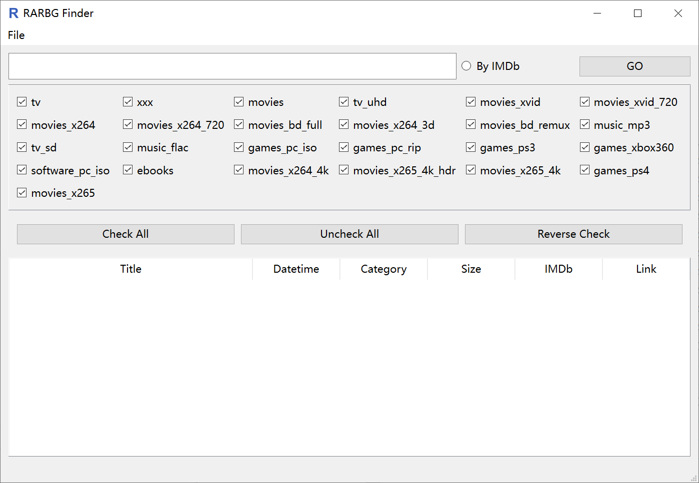

RARBG Finder
==========
Graphic tool for finding torrent links in RARBG.

----
Data source: [2004content/rarbg](https://github.com/2004content/rarbg/),
unavailable now due to DMCA takedown.

---
This software creates cache form original data, after that it can work without that.  
But you can not clear cache anymore otherwise you'll lose all the data.  

**It's little risky to put original data in this repo, but the released packages contain pickled dataframe.  
And yes, do not clear cache unless you got the original csv data.**